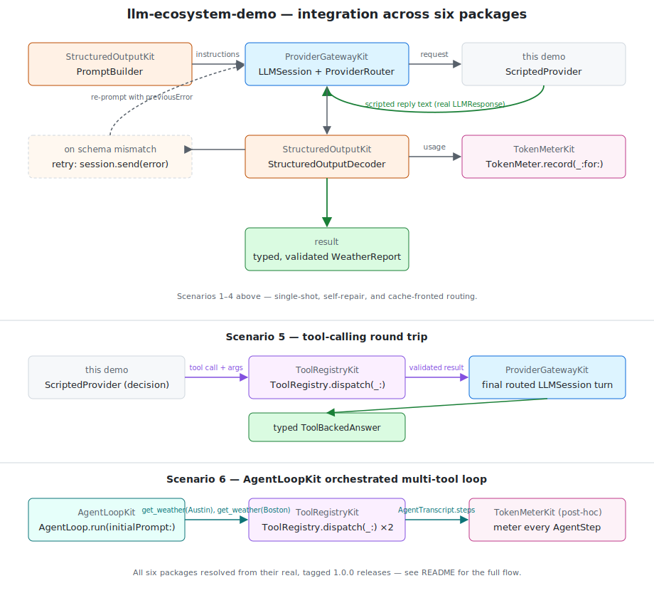
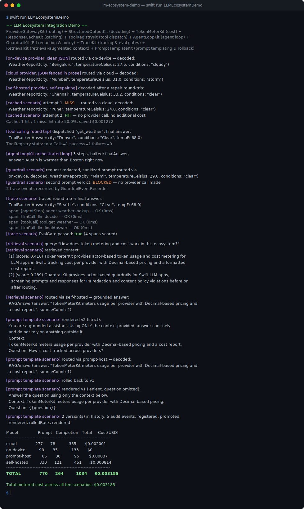

# LLM Ecosystem Demo

A single runnable demo that wires together all ten packages in this
ecosystem — [`ProviderGatewayKit`](https://github.com/rajatslakhina/foundation-model-provider-gateway),
[`TokenMeterKit`](https://github.com/rajatslakhina/token-meter-kit),
[`StructuredOutputKit`](https://github.com/rajatslakhina/structured-output-kit),
[`ResponseCacheKit`](https://github.com/rajatslakhina/response-cache-kit),
[`ToolRegistryKit`](https://github.com/rajatslakhina/tool-registry-kit),
[`AgentLoopKit`](https://github.com/rajatslakhina/agent-loop-kit),
[`GuardrailKit`](https://github.com/rajatslakhina/guardrail-kit),
[`TraceKit`](https://github.com/rajatslakhina/trace-kit),
[`RetrievalKit`](https://github.com/rajatslakhina/retrieval-kit), and
[`PromptTemplateKit`](https://github.com/rajatslakhina/prompt-template-kit)
— against each other's real, tagged `1.0.0` releases. Where each package's
own demo shows that package in isolation, this one shows the seams between
them: a routed call that gets decoded into a typed value, metered for cost,
answered from cache on a repeat request, dispatched to a registered tool
and routed again for a final answer, driven through a multi-step
tool-calling loop until the model converges, captured as a nested trace
and scored by an eval gate, grounded in context retrieved from a small
indexed knowledge base before the model ever answers, or rendered from a
versioned, rollback-capable prompt template before that render's own
output becomes the routed call's prompt text.

| Package | Role in this demo |
|---|---|
| [`ProviderGatewayKit`](https://github.com/rajatslakhina/foundation-model-provider-gateway) | Routes every call through a real `ProviderRouter`/`LLMSession` |
| [`StructuredOutputKit`](https://github.com/rajatslakhina/structured-output-kit) | Builds the schema instructions and extracts/validates each routed reply |
| [`TokenMeterKit`](https://github.com/rajatslakhina/token-meter-kit) | Meters every routed hop against registered per-provider rates |
| [`ResponseCacheKit`](https://github.com/rajatslakhina/response-cache-kit) | Sits in front of the router so a repeated request never re-pays for a call |
| [`ToolRegistryKit`](https://github.com/rajatslakhina/tool-registry-kit) | Validates and dispatches a tool call the model "decides" to make, mid round trip |
| [`AgentLoopKit`](https://github.com/rajatslakhina/agent-loop-kit) | Drives a bounded, multi-step decide/act/observe loop across several dependent tool calls |
| [`GuardrailKit`](https://github.com/rajatslakhina/guardrail-kit) | Redacts PII and enforces content policy before a prompt is routed and after a reply comes back |
| [`TraceKit`](https://github.com/rajatslakhina/trace-kit) | Captures a nested trace of the routed calls and tool dispatch, then scores it with an `EvalGate` |
| [`RetrievalKit`](https://github.com/rajatslakhina/retrieval-kit) | Indexes a small knowledge base and retrieves the context grounding the final routed answer |
| [`PromptTemplateKit`](https://github.com/rajatslakhina/prompt-template-kit) | Versions a prompt template, renders the active version, and feeds that rendered text into a routed call |



## What it demonstrates

1. **`ProviderGatewayKit`** routes a turn through an `LLMSession` backed by
   a `ProviderRouter`, across three different provider identities
   (on-device, cloud, self-hosted).
2. **`StructuredOutputKit`** builds the schema instructions appended to the
   prompt, then extracts and validates the routed reply — clean JSON,
   JSON fenced in prose, and a malformed-then-repaired reply that goes
   through a real second routed call, not just a canned retry string.
3. **`TokenMeterKit`** meters every routed hop (including the failed first
   attempt in the repair scenario) against registered per-provider rates,
   and prints a per-model and total cost report.
4. **`ResponseCacheKit`** sits in front of the same routed pipeline for a
   fourth scenario: the same question asked twice. The first call is a
   real MISS — routed and metered exactly like the scenarios above. The
   second call never reaches `ProviderRouter` at all; `ResponseCache`
   answers from its own storage, and the cost that would have been
   re-paid shows up in `estimatedSavings` instead of a second metered hop.
5. **`ToolRegistryKit`** handles a fifth scenario: a routed turn "decides"
   to call a `get_weather` tool. `ToolRegistry.dispatch(_:)` decodes and
   schema-validates the arguments *before* the registered handler runs,
   and the handler's result is fed back into a second routed turn for the
   model's final, schema-validated answer — two metered hops, one
   validated tool call, no unchecked handler input.
6. **`AgentLoopKit`** handles a sixth scenario, and generalizes the one
   above: rather than hand-wiring a single tool-call round trip across two
   manually built `LLMSession`s, `AgentLoop.run(initialPrompt:)` drives a
   bounded loop that chains *two* dependent `get_weather` calls (comparing
   Austin and Boston) before the model converges on a final answer.
   `TokenMeterKit` meters every step entirely after the fact, straight off
   the returned `AgentTranscript` — `AgentLoopKit` never needs to know
   `TokenMeterKit` exists.
7. **`GuardrailKit`** handles a seventh scenario, sitting in front of *and*
   behind the same routed pipeline: a user prompt carrying a real email
   address is redacted by `GuardrailPipeline.screenRequest(_:)` before it
   ever reaches `ProviderRouter`/`LLMSession` — the provider only ever sees
   the sanitized text — and the reply is screened again with
   `screenResponse(_:)` on the way back out. A second prompt trips a
   banned-phrase content policy rule and is blocked outright: no provider
   call is made and nothing is metered for it. Every screening — redacted,
   allowed, or blocked — is recorded as a `GuardrailEvent` by an
   `InMemoryGuardrailEventRecorder`.
8. **`TraceKit`** handles an eighth scenario: the same decide/dispatch/answer
   round trip the fifth scenario hand-rolled, but with each step wrapped in
   `Tracer.withSpan(name:kind:parentID:operation:)` under one manually
   managed root `agentStep` span. `Tracer.trace(rootID:)` reconstructs the
   full nested trace afterward, and an `EvalGate` scores it against
   `NoErrorSpansScorer` and `MaxDurationScorer` — turning "did this composed
   call succeed, and fast enough" into an enforced pass/fail check instead
   of eyeballed print output.
9. **`RetrievalKit`** handles a ninth scenario, and is the first one that
   isn't fronting a *routed* call but *preceding* it: a `Retriever` indexes
   four short documents (one per sibling package) with a deterministic
   `HashingEmbeddingProvider`, then `retrieveContextBlock(query:)` ranks
   and returns the chunks most relevant to a real question. That context
   block is prepended to the prompt handed to a routed `LLMSession.send()`
   call, and the reply is decoded as a `RAGAnswer` — the actual
   retrieve-then-generate pattern, with `RetrievalKit` doing real cosine
   similarity ranking rather than a hand-picked "relevant" string.
10. **`PromptTemplateKit`** handles a tenth scenario: `PromptRegistry`
    registers a context+question system-prompt template at v1, promotes a
    more explicit v2 that becomes active immediately, and
    `render(name:variables:mode:)` renders that active version (strict
    mode) into real prompt text. Only that *rendered string* — never the
    raw template — is handed to a routed `LLMSession.send()` call, decoded
    as a `RAGAnswer` and metered like every other scenario:
    `PromptTemplateKit` renders, `ProviderGatewayKit` sends.
    `rollbackToPrevious(name:)` then restores v1, and a second
    `render(mode: .lenient)` call leaves an unresolved placeholder as
    literal text rather than throwing — every register/promote/render/
    rollback action along the way is captured by an
    `InMemoryPromptAuditRecorder`.

Each scenario uses a `ScriptedProvider` — a demo-only conformer to
`ProviderGatewayKit`'s real `LLMProvider` protocol that answers from a
fixed script instead of a live network or on-device runtime, exactly the
same pattern `ProviderGatewayKit` uses internally for its own
`SimulatedCloudProvider`. Everything *around* that one scripted seam —
routing, session turn-serialization, schema validation, extraction, the
retry loop, caching, tool dispatch, and cost accounting — is the real,
compiled code from all ten tagged packages.

Note: `ProviderGatewayKit` ships its own minimal, string-only
`ToolRegistry`/`ToolCallRequest` types for basic tool round-tripping.
`ToolRegistryKit` is a separate, richer package for host apps that want
real `JSONSchema` argument validation and structured `JSONValue` results
before a handler ever runs — this demo qualifies both types explicitly
(`ToolRegistryKit.ToolRegistry`, `ToolRegistryKit.ToolCallRequest`) since
both packages export a same-named type.

## Installation

This repository is a runnable demo, not a library — there's nothing to add
to your own `Package.swift`. To build it yourself:

```bash
git clone https://github.com/rajatslakhina/llm-ecosystem-demo.git
cd llm-ecosystem-demo
swift run LLMEcosystemDemo
```

Swift Package Manager resolves `ProviderGatewayKit`, `TokenMeterKit`,
`StructuredOutputKit`, `ResponseCacheKit`, `ToolRegistryKit`, `AgentLoopKit`,
`GuardrailKit`, `TraceKit`, `RetrievalKit`, and `PromptTemplateKit` straight
from their `1.0.0` tags — no local checkouts or path overrides needed.

## Sample output



## Quality

- **Build:** `swift build` — clean, zero warnings, resolving all ten
  dependencies from their real tagged releases.
- **Run:** `swift run LLMEcosystemDemo` — exercises the real, compiled code
  of all ten packages together; the output above is a genuine capture,
  not a mock-up.
- **Lint:** `swiftlint lint --strict` — zero violations. (An earlier version
  of this README noted `swiftlint` wasn't installable in the sandbox this
  demo was originally built in and that the source had been hand-checked
  instead — that limitation was specific to that sandbox, not this
  package; on a machine with the toolchain installed natively, the real
  binary runs and passes clean.)

This repository intentionally has no test target — it's an integration
demo, not a library with independently testable units. Correctness here
means "the ten real packages compose and run," which the sample output
above demonstrates directly rather than through unit assertions.

## Architecture

```
Your prompt schema (JSONSchemaConvertible)
        │
        ▼
StructuredOutputKit.PromptBuilder  ──instructions──▶  ProviderGatewayKit.LLMSession
        ▲                                                       │
        │                                              routed reply text
        │                                                       ▼
StructuredOutputKit.StructuredOutputDecoder  ◀──raw text── ProviderRouter + ScriptedProvider
        │
        ▼
   typed, validated value                     TokenMeterKit.TokenMeter records
                                               usage + cost for every routed hop

ResponseCacheKit.ResponseCache sits in front of a second LLMSession/ProviderRouter
pair for the fourth scenario: response(for:) is checked before every routed
send() — a HIT returns immediately with no router call; a MISS routes, meters,
then store()s the reply for the next identical request.

For the fifth scenario, a routed turn's reply is decoded as a tool-call
request; ToolRegistryKit.ToolRegistry.dispatch(_:) schema-validates the
arguments, runs the registered handler, and the result is fed into a
second routed turn whose reply is decoded as the final typed answer.

For the sixth scenario, AgentLoopKit.AgentLoop.run(initialPrompt:) drives
the same LLMSession + ToolRegistry pair through a bounded decide/act/
observe loop across two dependent get_weather calls; TokenMeterKit meters
every step straight off the returned AgentTranscript, after the fact.

For the seventh scenario, GuardrailKit.GuardrailPipeline sits on both sides
of an LLMSession/ProviderRouter pair: screenRequest(_:) redacts PII from
the user's prompt before send() is ever called, and screenResponse(_:)
screens the routed reply on the way back out. A second prompt trips a
BannedPhraseRule and is blocked before any router call happens at all.
Every screening is recorded as a GuardrailEvent, regardless of verdict.

For the eighth scenario, TraceKit.Tracer wraps the same decide/dispatch/
answer round trip the fifth scenario hand-rolled: each LLMSession.send()
and ToolRegistry.dispatch(_:) call is wrapped in withSpan(name:kind:
parentID:operation:) under one root agentStep span. Tracer.trace(rootID:)
reconstructs the full nested trace afterward, and EvalGate.run(_:scorers:)
scores it against NoErrorSpansScorer and MaxDurationScorer, producing an
EvalGateReport instead of a print statement someone has to read by hand.

For the ninth scenario, RetrievalKit.Retriever indexes four documents with
a HashingEmbeddingProvider, then retrieveContextBlock(query:) ranks stored
chunks by cosine similarity and returns the top matches as a prompt-ready
text block — computed entirely locally, no routed call involved yet. That
block is prepended to the prompt for a single routed LLMSession.send()
call, decoded as a RAGAnswer. RetrievalKit has no compile-time dependency
on ProviderGatewayKit; the seam is exactly what a host app would wire up
itself — retrieve, then prepend, then send.

For the tenth scenario, PromptTemplateKit.PromptRegistry registers a
context+question system-prompt template at v1, promotes a more explicit
v2 that becomes active immediately, and render(name:variables:mode:) renders
that active version (strict mode) into real prompt text — only that
rendered string, never the raw template, is handed to a routed
LLMSession.send() call, decoded as a RAGAnswer and metered exactly like
every other scenario. rollbackToPrevious(name:) then restores v1, and a
second render(mode: .lenient) call leaves an unresolved placeholder as
literal text instead of throwing. Every register/promote/render/rollback
action is captured by an InMemoryPromptAuditRecorder. PromptTemplateKit
has no compile-time dependency on ProviderGatewayKit either — the seam is
the same one every sibling kit uses: render (or retrieve, or dispatch)
first, then send.
```

## License

MIT © 2026 Rajat S. Lakhina. See [LICENSE](LICENSE).
