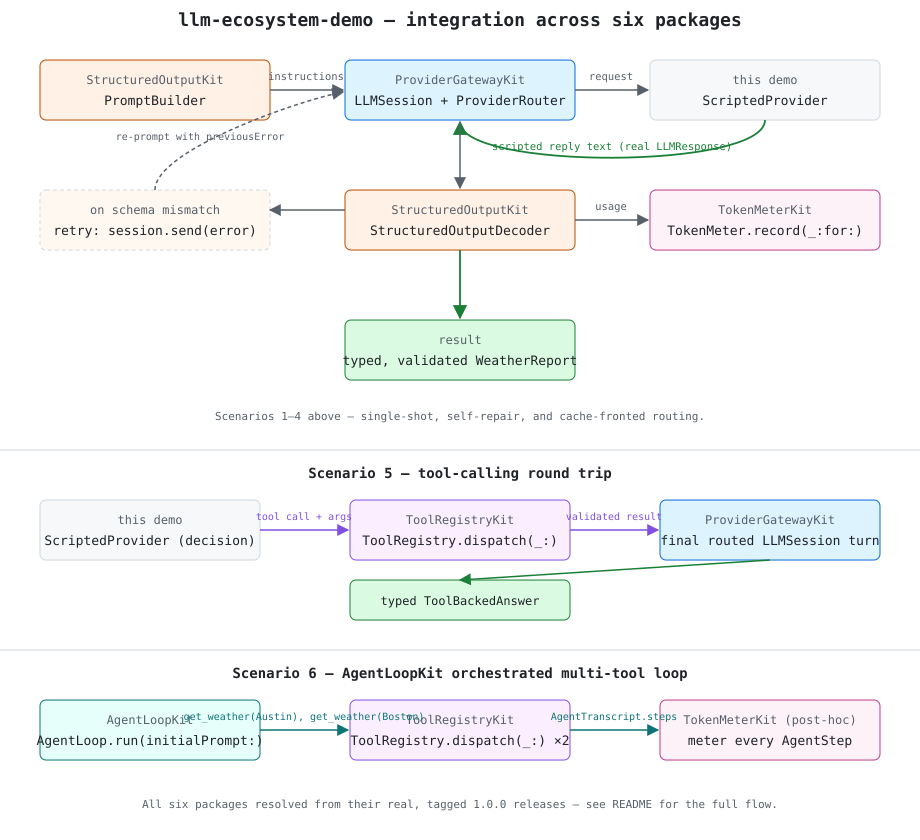
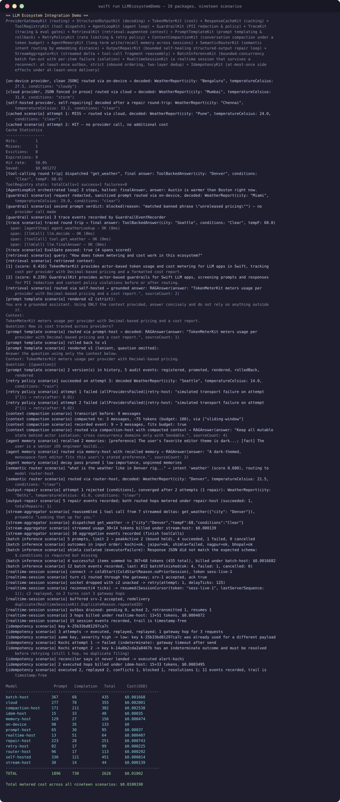

# LLM Ecosystem Demo

A single runnable demo that wires together all thirty-two packages in this
ecosystem — [`ProviderGatewayKit`](https://github.com/rajatslakhina/foundation-model-provider-gateway),
[`TokenMeterKit`](https://github.com/rajatslakhina/token-meter-kit),
[`StructuredOutputKit`](https://github.com/rajatslakhina/structured-output-kit),
[`ResponseCacheKit`](https://github.com/rajatslakhina/response-cache-kit),
[`ToolRegistryKit`](https://github.com/rajatslakhina/tool-registry-kit),
[`AgentLoopKit`](https://github.com/rajatslakhina/agent-loop-kit),
[`GuardrailKit`](https://github.com/rajatslakhina/guardrail-kit),
[`TraceKit`](https://github.com/rajatslakhina/trace-kit),
[`RetrievalKit`](https://github.com/rajatslakhina/retrieval-kit),
[`PromptTemplateKit`](https://github.com/rajatslakhina/prompt-template-kit),
[`RetryPolicyKit`](https://github.com/rajatslakhina/retry-policy-kit),
[`ContextCompactionKit`](https://github.com/rajatslakhina/context-compaction-kit),
[`AgentMemoryKit`](https://github.com/rajatslakhina/agent-memory-kit),
[`SemanticRouterKit`](https://github.com/rajatslakhina/semantic-router-kit),
[`OutputRepairKit`](https://github.com/rajatslakhina/output-repair-kit),
[`StreamAggregatorKit`](https://github.com/rajatslakhina/stream-aggregator-kit), and
[`BatchInferenceKit`](https://github.com/rajatslakhina/batch-inference-kit), and
[`RealtimeSessionKit`](https://github.com/rajatslakhina/realtime-session-kit), and
[`IdempotencyKit`](https://github.com/rajatslakhina/idempotency-kit), and
[`SchemaMigrationKit`](https://github.com/rajatslakhina/schema-migration-kit), and
[`ToolAuthorityKit`](https://github.com/rajatslakhina/tool-authority-kit), and
[`GroundingKit`](https://github.com/rajatslakhina/grounding-kit), and
[`QuotaGovernorKit`](https://github.com/rajatslakhina/quota-governor-kit), and
[`CostEstimatorKit`](https://github.com/rajatslakhina/cost-estimator-kit), and
[`WorkloadProfilerKit`](https://github.com/rajatslakhina/workload-profiler-kit), and
[`ClaimConsistencyKit`](https://github.com/rajatslakhina/claim-consistency-kit)
— against each other's real, tagged `1.0.0` releases. Where each package's
own demo shows that package in isolation, this one shows the seams between
them: a routed call that gets decoded into a typed value, metered for cost,
answered from cache on a repeat request, dispatched to a registered tool
and routed again for a final answer, driven through a multi-step
tool-calling loop until the model converges, captured as a nested trace
and scored by an eval gate, grounded in context retrieved from a small
indexed knowledge base before the model ever answers, rendered from a
versioned, rollback-capable prompt template before that render's own
output becomes the routed call's prompt text, retried with exponential
backoff after the provider genuinely fails at the transport layer,
compacted down to a token budget before the compacted result — not the
raw, ever-growing transcript — becomes the next routed call's context, or
recalled from a long-term memory store, ranked by more than raw
similarity, before that recalled context grounds the final answer, or
classified into a support intent by embedding distance so the matched
route's own metadata — not a hard-coded branch — picks which model answers,
or driven through a bounded, self-healing repair loop that re-prompts the
routed model with structured feedback until the reply satisfies its output
contract, or fanned out as a whole batch of prompts through one executor
with a hard cap on how many are in flight, coming back in input order with
one bad reply isolated to its own item instead of taking the job down.

| Package | Role in this demo |
|---|---|
| [`ProviderGatewayKit`](https://github.com/rajatslakhina/foundation-model-provider-gateway) | Routes every call through a real `ProviderRouter`/`LLMSession` |
| [`StructuredOutputKit`](https://github.com/rajatslakhina/structured-output-kit) | Builds the schema instructions and extracts/validates each routed reply |
| [`TokenMeterKit`](https://github.com/rajatslakhina/token-meter-kit) | Meters every routed hop against registered per-provider rates |
| [`ResponseCacheKit`](https://github.com/rajatslakhina/response-cache-kit) | Sits in front of the router so a repeated request never re-pays for a call |
| [`ToolRegistryKit`](https://github.com/rajatslakhina/tool-registry-kit) | Validates and dispatches a tool call the model "decides" to make, mid round trip |
| [`AgentLoopKit`](https://github.com/rajatslakhina/agent-loop-kit) | Drives a bounded, multi-step decide/act/observe loop across several dependent tool calls |
| [`GuardrailKit`](https://github.com/rajatslakhina/guardrail-kit) | Redacts PII and enforces content policy before a prompt is routed and after a reply comes back |
| [`TraceKit`](https://github.com/rajatslakhina/trace-kit) | Captures a nested trace of the routed calls and tool dispatch, then scores it with an `EvalGate` |
| [`RetrievalKit`](https://github.com/rajatslakhina/retrieval-kit) | Indexes a small knowledge base and retrieves the context grounding the final routed answer |
| [`PromptTemplateKit`](https://github.com/rajatslakhina/prompt-template-kit) | Versions a prompt template, renders the active version, and feeds that rendered text into a routed call |
| [`RetryPolicyKit`](https://github.com/rajatslakhina/retry-policy-kit) | Retries a routed call with exponential backoff after a genuine transport-layer failure |
| [`ContextCompactionKit`](https://github.com/rajatslakhina/context-compaction-kit) | Compacts a growing transcript down to a token budget before the next routed call |
| [`AgentMemoryKit`](https://github.com/rajatslakhina/agent-memory-kit) | Recalls long-term memories, ranked by similarity/recency/importance/frequency, to ground a routed answer |
| [`SemanticRouterKit`](https://github.com/rajatslakhina/semantic-router-kit) | Classifies a query into a support intent by embedding distance; the matched route's metadata picks which model the routed call targets |
| [`OutputRepairKit`](https://github.com/rajatslakhina/output-repair-kit) | Wraps a routed call in a bounded repair loop: rejects an invalid reply with structured issues, folds them into a correction prompt, and re-prompts until it validates or the budget is spent |
| [`StreamAggregatorKit`](https://github.com/rajatslakhina/stream-aggregator-kit) | Reassembles a streamed reply — content fragments and index-keyed tool-call argument fragments — into one message, then dispatches the reassembled tool call and bills the exact streamed usage under `stream-host` |
| [`BatchInferenceKit`](https://github.com/rajatslakhina/batch-inference-kit) | Runs a batch of prompts through one bounded-concurrency executor that forwards each item to the gateway, returns outcomes in input order, isolates the one off-contract reply, and hands its summed successful usage to `TokenMeter` under `batch-host` |
| [`RealtimeSessionKit`](https://github.com/rajatslakhina/realtime-session-kit) | Holds a live session together across a socket drop: an at-least-once outbox replays the turn the server never acknowledged (a second real gateway hop), the resume continues from the client's own cursor, a redelivered server event is caught by the id window, and every hop bills under `realtime-host` |
| [`IdempotencyKit`](https://github.com/rajatslakhina/idempotency-kit) | Guards a side-effecting routed call so it runs at most once: three attempts under one derived key cost a single gateway hop, the same key with a changed payload is refused, an indeterminate timeout freezes the key until a reconciler settles it, and only the hops that really ran bill under `idem-host` |
| [`SchemaMigrationKit`](https://github.com/rajatslakhina/schema-migration-kit) | Migrates a payload written under an older contract into the shape today's decoder wants, with every hop validated against the schema it promised: a cached v1 reply is classified as a breaking change, refused while it would silently drop a field, then migrated with the loss opted into and decoded by the real `StructuredOutputDecoder` — all at zero gateway hops |
| [`ToolAuthorityKit`](https://github.com/rajatslakhina/tool-authority-kit) | Refuses a tool call the rest of the pipeline was happy to pass along: a retrieved passage carries an injected instruction, the routed turn proposes the outbound send it asked for, and the broker denies it on the one axis no other layer models — where the arguments came from. The same grant allows a read from that same untrusted source, and escalates a refund to a human whose signature covers that refund and no other |
| [`GroundingKit`](https://github.com/rajatslakhina/grounding-kit) | Checks the answer itself against the passages it was given: `StructuredOutputKit` accepts the reply because the shape is valid, and `GroundingVerifier` then gives each sentence its own verdict — one grounded and correctly cited, one inflating a number its source refutes (`contradicted`, not merely unsupported), and one citing a document that was never retrieved. Under `.strip` the grounded remainder is published and the rest is named, at zero extra gateway hops |
| [`QuotaGovernorKit`](https://github.com/rajatslakhina/quota-governor-kit) | Decides whether the *next* hop may run at all. `reserve` holds an estimate on every scope of a `tenant / run` path before the gateway is called; `TokenMeter` prices the response; `settle` closes the reservation against that real figure, so the metered cost becomes the input to the next admission decision rather than a report at the end. One settlement comes in under its hold on tokens and over it on money at once. A run budget cuts a loop off at step 4 while the tenant never notices, and a badly estimated answer leaves its scope in arrears — the spend already happened, so all the governor can do is refuse what comes next |
| [`CostEstimatorKit`](https://github.com/rajatslakhina/cost-estimator-kit) | Supplies the estimate `QuotaGovernorKit` reserves against, instead of it being a literal. A `WorkloadPlan` describes the loop shape — steps, tool calls per step, tool-result size, cache hit rate, retry overhead, compaction — and the forecast walks the transcript forward step by step, because an agent loop resends everything said so far. In this scenario the flat estimate says 200 input tokens and the run really uses 715. Output length is the one value a plan cannot supply, so it sits behind a predictor protocol and is learned per shape; reconciling against `TokenMeter`'s real figure feeds both the predictor and the width of the band |
| [`WorkloadProfilerKit`](https://github.com/rajatslakhina/workload-profiler-kit) | Answers the question `CostEstimatorKit` leaves open: where does the *plan* come from? Inverts the forecast — from the per-hop input counts of runs that already happened it recovers steps, tool shape, output length, retry overhead, cache hit rate and compaction thresholds, reporting the share of observed input it cannot account for rather than absorbing it. Then it gates the hand-written plan against what the runs did: scenario 24's literal drifts on exactly one of seven fields, `expectedOutputTokensPerStep` declared 15 against 56 observed — the same field scenario 24's own 81% overrun is caused by |
| [`ClaimConsistencyKit`](https://github.com/rajatslakhina/claim-consistency-kit) | Asks the question overlap cannot: given the passage a claim already matched, do the two *agree*? Five deterministic rules — polarity, numerics with units and bounds, quantifier and modal scope, version ordering, mutually exclusive values — decided by reading two sentences, with no model call. Scenario 26 runs it on `GroundingKit`'s own matches: it agrees on the polarity flip, **withdraws a grounding false positive** (`5 times` against `at least 3 times` is a satisfied bound, not a conflict), and catches the two claims that carry neither negation nor numbers, so nothing in an overlap score can reach them |
| [`SourceConflictKit`](https://github.com/rajatslakhina/source-conflict-kit) | Asks the question every check above asks too late: do the retrieved passages agree with *each other*? Topic-scoped conflict groups, corroboration counted in distinct documents rather than chunks, an explicit tie-breaker ladder that stands aside rather than guessing, and a block when sources cannot be reconciled. Scenario 27 runs the same audit twice — once with the built-in lexical oracle, once with `ClaimConsistencyKit` plugged in through the `ContradictionOracle` seam — and the propositional oracle **withholds one fewer passage**, because the lexical one manufactures a conflict out of a satisfied bound |
| [`ClaimSegmenterKit`](https://github.com/rajatslakhina/claim-segmenter-kit) | The unit every check above takes for granted. Grounding, claim consistency and source conflict all begin by cutting text into claims, and all three inherit whatever that cut gets wrong — silently, because a claim lost at a boundary is never checked rather than reported as a miss. Protected spans for code, URLs and quotes; Markdown structure; and clause-level splitting that carries the subject forward or refuses the cut. Scenario 28 runs `GroundingKit`'s verifier twice over one answer, changing nothing but the segmenter behind its `ClaimSegmenting` seam |
| [`CitationBindingKit`](https://github.com/rajatslakhina/citation-binding-kit) | The question every verifier above skips: not *which document supports this claim best*, but *does the document the answer actually named support it*. A verifier that keeps the best-scoring source has no opinion about what was cited, and the finer a claim gets the more of its wording it shares with a near neighbour. Honours the citation over the score, and reports the divergence rather than silently rebinding. Scenario 29 runs it over the exact claims scenario 28 produced |
| [`ClaimDecontextualizerKit`](https://github.com/rajatslakhina/claim-decontextualizer-kit) | The step before every verifier above, and the one that decides whether they had anything to work with. A claim lifted out of a paragraph often has no subject — `It is not shared across sessions` cannot be scored correctly, only scored. Rewrites what a decisive antecedent justifies, and refuses in two directions: when candidates are too close to choose between, and when a correct-but-long antecedent would narrow the claim beyond what the sentence asserted. `standaloneText(at:)` returns `nil` for every refusal, so an unresolved claim cannot be forwarded by accident. Scenario 30 |
| [`AnswerabilityKit`](https://github.com/rajatslakhina/answerability-kit) | The only gate in this table that runs *before* the provider call. Every verifier above it judges an answer already paid for; this one judges whether the question was answerable from the retrieved evidence at all. Splits the question into aspects and checks each against the corpus, separating a gap (`insufficient` — retrieve more) from a contradiction (`contested` — retrieving more makes it worse) from the gate having no opinion (`undetermined` — it could not read the question, or was handed nothing to read). `approvedQuestion` is `nil` for every verdict but approval, so a caller that forgets to switch cannot spend money. Scenario 31 |
| [`MorphologyMatchKit`](https://github.com/rajatslakhina/morphology-match-kit) | The recall floor underneath the gate above it. `AnswerabilityKit` refuses when nothing in the corpus speaks to an aspect — but that is an inference from a matcher finding no overlap, and it is worth exactly what the matcher's recall is worth. Keys inflectional families onto one bucket so a question about `requests` that were `retried` matches a corpus saying a client `retries` a `request`. Inflectional rules only: no `-er`, no `-ation`, length floors, and no key may land on a function word, because `note` keying to `not` would make every clause mentioning a note read as a denial. Every refused conflation is reported as a rule rather than a silence. Scenario 32 |



## What it demonstrates

1. **`ProviderGatewayKit`** routes a turn through an `LLMSession` backed by
   a `ProviderRouter`, across three different provider identities
   (on-device, cloud, self-hosted).
2. **`StructuredOutputKit`** builds the schema instructions appended to the
   prompt, then extracts and validates the routed reply — clean JSON,
   JSON fenced in prose, and a malformed-then-repaired reply that goes
   through a real second routed call, not just a canned retry string.
3. **`TokenMeterKit`** meters every routed hop (including the failed first
   attempt in the repair scenario) against registered per-provider rates,
   and prints a per-model and total cost report.
4. **`ResponseCacheKit`** sits in front of the same routed pipeline for a
   fourth scenario: the same question asked twice. The first call is a
   real MISS — routed and metered exactly like the scenarios above. The
   second call never reaches `ProviderRouter` at all; `ResponseCache`
   answers from its own storage, and the cost that would have been
   re-paid shows up in `estimatedSavings` instead of a second metered hop.
5. **`ToolRegistryKit`** handles a fifth scenario: a routed turn "decides"
   to call a `get_weather` tool. `ToolRegistry.dispatch(_:)` decodes and
   schema-validates the arguments *before* the registered handler runs,
   and the handler's result is fed back into a second routed turn for the
   model's final, schema-validated answer — two metered hops, one
   validated tool call, no unchecked handler input.
6. **`AgentLoopKit`** handles a sixth scenario, and generalizes the one
   above: rather than hand-wiring a single tool-call round trip across two
   manually built `LLMSession`s, `AgentLoop.run(initialPrompt:)` drives a
   bounded loop that chains *two* dependent `get_weather` calls (comparing
   Austin and Boston) before the model converges on a final answer.
   `TokenMeterKit` meters every step entirely after the fact, straight off
   the returned `AgentTranscript` — `AgentLoopKit` never needs to know
   `TokenMeterKit` exists.
7. **`GuardrailKit`** handles a seventh scenario, sitting in front of *and*
   behind the same routed pipeline: a user prompt carrying a real email
   address is redacted by `GuardrailPipeline.screenRequest(_:)` before it
   ever reaches `ProviderRouter`/`LLMSession` — the provider only ever sees
   the sanitized text — and the reply is screened again with
   `screenResponse(_:)` on the way back out. A second prompt trips a
   banned-phrase content policy rule and is blocked outright: no provider
   call is made and nothing is metered for it. Every screening — redacted,
   allowed, or blocked — is recorded as a `GuardrailEvent` by an
   `InMemoryGuardrailEventRecorder`.
8. **`TraceKit`** handles an eighth scenario: the same decide/dispatch/answer
   round trip the fifth scenario hand-rolled, but with each step wrapped in
   `Tracer.withSpan(name:kind:parentID:operation:)` under one manually
   managed root `agentStep` span. `Tracer.trace(rootID:)` reconstructs the
   full nested trace afterward, and an `EvalGate` scores it against
   `NoErrorSpansScorer` and `MaxDurationScorer` — turning "did this composed
   call succeed, and fast enough" into an enforced pass/fail check instead
   of eyeballed print output.
9. **`RetrievalKit`** handles a ninth scenario, and is the first one that
   isn't fronting a *routed* call but *preceding* it: a `Retriever` indexes
   four short documents (one per sibling package) with a deterministic
   `HashingEmbeddingProvider`, then `retrieveContextBlock(query:)` ranks
   and returns the chunks most relevant to a real question. That context
   block is prepended to the prompt handed to a routed `LLMSession.send()`
   call, and the reply is decoded as a `RAGAnswer` — the actual
   retrieve-then-generate pattern, with `RetrievalKit` doing real cosine
   similarity ranking rather than a hand-picked "relevant" string.
10. **`PromptTemplateKit`** handles a tenth scenario: `PromptRegistry`
    registers a context+question system-prompt template at v1, promotes a
    more explicit v2 that becomes active immediately, and
    `render(name:variables:mode:)` renders that active version (strict
    mode) into real prompt text. Only that *rendered string* — never the
    raw template — is handed to a routed `LLMSession.send()` call, decoded
    as a `RAGAnswer` and metered like every other scenario:
    `PromptTemplateKit` renders, `ProviderGatewayKit` sends.
    `rollbackToPrevious(name:)` then restores v1, and a second
    `render(mode: .lenient)` call leaves an unresolved placeholder as
    literal text rather than throwing — every register/promote/render/
    rollback action along the way is captured by an
    `InMemoryPromptAuditRecorder`.
11. **`RetryPolicyKit`** handles an eleventh scenario: `RetryExecutor` wraps
    a routed `LLMSession.send()` call against a `FlakyProvider` that
    genuinely throws for its first two attempts, then succeeds — a real
    transport-layer failure, not a malformed-reply repair like the third
    scenario. The same `LLMSession` is retried across all three attempts
    rather than rebuilt per attempt: `CircuitBreaker`'s default
    `failureThreshold` is 3 consecutive failures, so two failures followed
    by a success never trips it. `ExponentialBackoffRetryPolicy` computes
    the wait between attempts and an `InMemoryRetryEventRecorder` captures
    every attempt including the two failures; only the final, successful
    call is metered — matching how real LLM billing charges for completed
    responses, not failed ones.
12. **`ContextCompactionKit`** handles a twelfth scenario: a routed
    `LLMSession` conversation grows across four real turns (`LLMSession`
    is given a deliberately huge 100,000-token internal budget so its own
    `ContextBudgetManager` never trims anything during this scenario), then
    `session.currentTranscript()` is bridged into
    `[ContextCompactionKit.CompactableMessage]` and run through a full
    three-tier `ContextCompactor` — sliding-window, truncating, summarizing
    — against a 100-token budget the raw 9-message transcript can't fit.
    The *compacted* result (not the raw transcript) is joined into a text
    block and handed to the next routed `session.send()` call, decoded as
    a `RAGAnswer` and metered like every other scenario. An
    `InMemoryCompactionEventRecorder` captures the before/after token and
    message counts and which strategies actually fired.
13. **`AgentMemoryKit`** handles a thirteenth scenario: a `MemoryStore`
    holds three memories written in an earlier "session" — a pinned persona
    fact, a genuine preference, and a low-importance aside —
    `recall(query:topK:)` ranks them by semantic similarity blended with
    recency, importance, and access frequency (not raw vector distance
    alone) and returns the two most relevant. Their content, not a
    hand-picked string, is folded into the prompt for a routed
    `LLMSession.send()` call, decoded as a `RAGAnswer` and metered like
    every other scenario. A final `decay(pruneBelow:)` call then fades and
    prunes the low-importance aside while the pinned persona fact survives
    untouched — demonstrating the guarantee that pinning in this package
    has no loophole.
14. **`SemanticRouterKit`** handles a fourteenth scenario: a `SemanticRouter`
    registers three support intents (weather, order status, small talk),
    each described by seed utterances and carrying the model a match should
    route to in its `metadata`. An incoming message is classified by
    embedding distance to the closest intent above its threshold, and the
    matched route's `metadata["model"]` — not a hard-coded branch — selects
    which provider the real routed `LLMSession.send()` call targets. This is
    semantic routing (by meaning) feeding provider routing (by capability):
    the reply is then decoded as a `WeatherReport` and metered like every
    other scenario.
15. **`OutputRepairKit`** handles a fifteenth scenario, the loop layer that
    sits *around* validation. An `OutputRepairLoop` drives a real routed
    `LLMSession` as its `ResponseProducing`: the provider's first reply omits
    a required field, so the loop's `WeatherRepairContract` rejects it with a
    structured `RepairIssue`, `DefaultRepairPrompter` folds that reason into a
    correction prompt, and the second routed call repairs it. Both hops — the
    rejected one and the repaired one — are metered under `repair-host`.
    Where `StructuredOutputKit`'s scenario shows *its own* internal retry,
    this shows a reusable repair loop wrapping *any* routed model, with a hard
    attempt budget and an auditable `RepairEvent` trail.
16. **`StreamAggregatorKit`** handles a sixteenth scenario, the front of the
    pipeline. A streaming provider never returns a finished reply — it emits a
    sequence of deltas, and its tool-call arguments arrive as JSON fragments
    keyed by index. A `StreamAggregator` reassembles that stream (a content
    preamble plus a `get_weather` call whose arguments dribble out across two
    fragments) into one `AssembledMessage`; the reassembled tool call is then
    dispatched through `ToolRegistryKit`, and the `usage` the stream carried is
    billed by `TokenMeter` at its exact counts under `stream-host` rather than
    re-estimated from text. `StreamAggregatorKit` has no compile-time
    dependency on the gateway — the `DeltaSource` is its only seam.
17. **`BatchInferenceKit`** handles a seventeenth scenario, the one that stops
    treating a routed call as a single event. Five prompts go into one
    `BatchProcessor` with `ConcurrencyLimit(2)`, and every item is a real
    `ProviderRouter`/`LLMSession` round trip: a `GatewayBatchExecutor` adapter
    is the `BatchExecuting` seam, so the batch genuinely fans out through
    `ProviderGatewayKit` rather than answering from canned strings. The output
    shows all three of the package's guarantees at once — `stats.peakActive`
    comes back as 2, proving the bound held rather than being merely requested;
    `report.outcomes` is in submission order regardless of which item finished
    first; and the third reply, which arrives missing the required `conditions`
    field, is rejected by `StructuredOutputKit` inside the adapter and isolated
    as a single `BatchItemError` under `.continueOnFailure` while the other four
    still complete. Billing is the closing seam: `BatchProcessor` sums
    `BatchTokenUsage` over *successful* items only, so the batch settles with
    one `TokenMeter.record` against `stats.usage` under `batch-host` and the
    failed item costs nothing — the same principle the retry scenario applies to
    failed attempts. `BatchInferenceKit` carries no retry or cost logic of its
    own by design, which is exactly why those two jobs stay with
    `RetryPolicyKit` and `TokenMeterKit` here instead of being duplicated.
18. **`RealtimeSessionKit`** handles an eighteenth scenario, the one that stops
    assuming the connection lasts. A live session sends two turns through a
    `GatewayRealtimeTransport` — the `RealtimeTransport` seam, so each turn is a
    real `ProviderRouter`/`LLMSession` round trip — and the socket drops with the
    second turn still unacknowledged. `handleDisconnect()` answers
    `retry(attempt: 1, delayTicks: 125)`: a full-jitter ceiling of 250 ticks with
    the jitter source pinned to its midpoint, which is the only reason a backoff
    number is assertable at all. The reconnect lands inside the 30-tick resume
    window, so the server is asked to continue from the client's *own* cursor
    rather than start over, and the unacknowledged turn is replayed — two turns
    costing three gateway hops, which is what at-least-once actually means rather
    than what it promises. The buffered server event is then accepted once and its
    immediate redelivery caught as `duplicate(repeatedID)`. All three hops, replay
    included, bill under `realtime-host`, so the cost of the retry is visible
    instead of hidden. This scenario sits *underneath*
    `StreamAggregatorKit`: that package reassembles the deltas of one response,
    this one owns the session those responses arrive on, and neither depends on
    the other at compile time.
19. **`IdempotencyKit`** closes a nineteenth scenario, and it is the exact
    counterpart of the eighteenth. There, a replay after a reconnect genuinely
    cost a second gateway hop, because at-least-once delivery means the effect
    really is re-sent. Here the duplicate never reaches a provider at all. A
    weather alert for Shimla is filed three times under one key derived from the
    payload — `k-25b33bd81297ca7c`, the same key either way round because the
    fields are canonicalised in sorted order before hashing — and the
    `GatewayEffectExecutor` behind the `EffectExecuting` seam records **one**
    gateway hop for those three requests, which is evidence rather than a claim,
    since a replay cannot reach the type that counts. Reusing that key with the
    severity changed from `high` to `low` is refused instead of answered with the
    earlier alert. A second alert, for Kochi, fails with an indeterminate gateway
    timeout — the failure mode that costs money — so the key is frozen: the retry
    is blocked, the hop count stays at one, and only after
    `resolve(key:as: .notApplied)` does the alert actually get filed. Two executed
    hops bill under `idem-host` at 15+33 tokens; the two replays bill nothing, by
    construction rather than by subtraction. `IdempotencyKit` deliberately does no
    retrying of its own — `RetryPolicyKit` decides *when* to try again, this
    decides *whether trying again is safe* — and has no compile-time dependency on
    any other package here.

Each scenario uses a `ScriptedProvider` — a demo-only conformer to
`ProviderGatewayKit`'s real `LLMProvider` protocol that answers from a
fixed script instead of a live network or on-device runtime, exactly the
same pattern `ProviderGatewayKit` uses internally for its own
`SimulatedCloudProvider`. Everything *around* that one scripted seam —
routing, session turn-serialization, schema validation, extraction, the
retry loop, caching, tool dispatch, and cost accounting — is the real,
compiled code from all nineteen tagged packages. (`RetryPolicyKit`'s own
scenario additionally uses a `FlakyProvider` — a demo-only conformer that
genuinely throws for its first two calls, since retrying only makes sense
against a real transport-layer failure, not a scripted success.)

Note: `ProviderGatewayKit` ships its own minimal, string-only
`ToolRegistry`/`ToolCallRequest` types for basic tool round-tripping.
`ToolRegistryKit` is a separate, richer package for host apps that want
real `JSONSchema` argument validation and structured `JSONValue` results
before a handler ever runs — this demo qualifies both types explicitly
(`ToolRegistryKit.ToolRegistry`, `ToolRegistryKit.ToolCallRequest`) since
both packages export a same-named type.

## Installation

This repository is a runnable demo, not a library — there's nothing to add
to your own `Package.swift`. To build it yourself:

```bash
git clone https://github.com/rajatslakhina/llm-ecosystem-demo.git
cd llm-ecosystem-demo
swift run LLMEcosystemDemo
20. **`SchemaMigrationKit`** adds a twentieth scenario, and it is the third
    distinct answer this toolkit gives to "don't pay for the same work twice."
    `ResponseCacheKit` avoids a second hop for an identical question.
    `IdempotencyKit` avoids a second hop for a retried side effect. Here the
    cached answer is neither identical nor retried — it is *stale in shape*, a
    reply stored under last year's contract, carrying a numeric `conditionCode`
    and a `stationId` that today's `WeatherReport` has no slot for. The registry
    classifies v1 -> v2 as BREAKING and says exactly why (`conditionCode`
    removed, `stationId` removed, `conditions` added), then **refuses** the
    migration, because the step admits it cannot carry `stationId` across.
    Passing `allowingLoss: true` runs it: the condition code is folded into the
    `conditions` band, the station id is dropped and named in the result, and
    the migrated payload is handed to the real `StructuredOutputDecoder`, which
    accepts it. All of that costs **zero gateway hops** — a schema migration is
    local computation, not a re-generation. The one hop the scenario does spend
    is a live routed turn whose reply already satisfies v2, so
    `negotiate(v2, v2)` returns `exact v2` and nothing migrates; it bills 9+17
    tokens under `schema-host`. Going the other way — serving a client still on
    v1 — needs no opt-in at all, because the band maps cleanly back onto a code
    and nothing is lost; that contrast is what makes the earlier refusal mean
    something.

```

Swift Package Manager resolves `ProviderGatewayKit`, `TokenMeterKit`,
`StructuredOutputKit`, `ResponseCacheKit`, `ToolRegistryKit`, `AgentLoopKit`,
`GuardrailKit`, `TraceKit`, `RetrievalKit`, `PromptTemplateKit`,
21. **`ToolAuthorityKit`** adds a twenty-first scenario, and it is the one
    scenario where a package's job is to *stop* the pipeline rather than move
    it along. `RetrievalKit` retrieves a knowledge-base passage that an
    attacker seeded with an instruction. `ProviderGatewayKit` routes a real
    turn, and the model does what the passage told it to: it proposes an
    outbound send of the customer list. `ToolRegistryKit` would have validated
    those arguments against the tool's schema and dispatched them, because
    they are perfectly well-formed — being well-formed is not the same as
    being permitted. `AuthorityBroker` refuses it on an axis no other layer
    models: the arguments' **provenance**. The same grant admits untrusted
    arguments for `read_order` and refuses them for `mailer.externalSend`,
    because a wrong order id costs a wrong answer while a wrong recipient
    costs the customer list — so the legitimate read is allowed and really
    dispatched. The refund is neither allowed nor refused but escalated:
    `.approvalRequired` carries the resource, the arguments and the provenance
    to a human, whose signature is bound by digest to that exact call — re-presented
    against a $4000 refund it throws `approvalDigestMismatch`, and the
    `ToolRegistry` ends the scenario having dispatched exactly the two calls
    that were authorized. One gateway hop, billed under `authority-host`, because
    an authorization decision is local computation.

22. **`GroundingKit`** closes the set with a twenty-second scenario, and it is
    the one that checks the *answer* rather than the machinery around it.
    `RetrievalKit` indexes and retrieves three real passages.
    `ProviderGatewayKit` routes a real turn. `StructuredOutputKit` decodes the
    reply and **accepts it** — every required field present and correctly typed,
    because a hallucination is not a schema violation. `GroundingVerifier` then
    asks the question nothing else in the pipeline is positioned to ask, and
    answers it three different ways for three sentences: the retention claim is
    `supported` at 100% and correctly cited; the export-limit claim says 5000
    where `kb-limits` says 500, which is `contradicted` rather than unsupported
    because the source does not merely fail to mention it — it says otherwise;
    and the enterprise claim cites `kb-enterprise`, a document that was never
    retrieved at all. `.strict` refuses with three violations, each naming its
    claim. `.stripping` removes c2 and c3 and publishes what survives. All of it
    costs **zero extra gateway hops**, which is the contrast with
    `OutputRepairKit`: repair pays a second hop to ask the model to try again,
    while verification is local computation. One hop, billed under
    `grounding-host`.

23. **`QuotaGovernorKit`** adds the twenty-third scenario, and it is the only
    one that can say *no*. Every scenario before it spends whatever it needs;
    `TokenMeterKit` can price a hop, but only once it has been paid for, and
    nothing in the toolkit could refuse the hop after it. `QuotaGovernor.reserve`
    holds an estimate against every scope on a `tenant-acme / run-atlas` path
    before `ProviderGatewayKit` routes the turn, `TokenMeter` prices the reply,
    and `settle` closes the reservation against that real figure — so the metered
    cost is the input to the next admission decision, not a summary at the end.
    Step 1 shows the per-axis claim rather than asserting it: a 150-token /
    60,000-microcent estimate held 180 / 72,000 under 20% headroom, the hop really
    cost 112 / 95,280, and the settlement reports **refunded 68 tokens / 0
    microcents** and **overran 0 tokens / 23,280 microcents** — under on tokens and
    over on money in one request, which one signed number would have netted out and
    reported as neither. Refunded holds then let the loop get further than a fixed
    reservation would have, and it still stops: 3 of 8 steps run before step 4 is
    refused with `run-atlas is out of tokens: 164 left, 180 requested`. A second
    run estimates badly — 180 held, 737 spent — so it breaches its ceiling, sits in
    arrears at -237 tokens, and is refused on its next request. `tenant-acme`
    absorbs both and finishes with 98,927 of 100,000 tokens, which is the nesting
    doing its job: a run that will not stop cannot reach past its own ceiling.

24. **`CostEstimatorKit`** adds the twenty-fourth scenario, and it answers the
    question scenario 23 leaves open: where did that estimate come from? There it
    was a literal. Here it is computed from the loop shape the caller already
    decided on before dispatching, and the loop below genuinely resends its
    transcript so the forecast is predicting the run that actually happens. That
    is the whole point — a flat "one call times four" estimate says **200 input
    tokens** and the run really uses **715**. Output length is the one input a
    plan cannot supply, so it sits behind `OutputLengthPredictor` and is learned
    per `InputShape`. Pass 1 carries a deliberately wrong prior of 15 output
    tokens per step against a model that writes closer to 56, and **overruns at
    81% on tokens and 130% on cost** — the ±50% prior band was wide enough to have
    warned first. Passes 2 and 3 land **within tolerance at 1%**, because the EMA
    predictor has seen a real run. The band does not tighten on contact: it goes
    **50% → 81% → 41%**, widening after the miss is recorded and only coming back
    down as accurate runs accumulate. A band that narrowed immediately after being
    wrong would be the wrong behaviour. Both packages price off the same rates —
    `estimator-host` at $2.80 / $11.20 per million is registered once with
    `TokenMeter` and once in the estimator's own `PriceBook` — so the reported
    error is error in predicting *work*, not two catalogs disagreeing. The forecast
    hands over as the two integers `QuotaGovernorKit` reserves against, and neither
    package imports the other.

25. **`WorkloadProfilerKit`** adds the twenty-fifth scenario, and it closes the
    loop the previous one opened. Scenario 24 forecasts from a `WorkloadPlan`
    somebody typed by hand, and its own narrative admits the prior of 15 output
    tokens per step was wrong. This scenario runs three real routed loops of 3, 4
    and 5 steps, records what each hop actually sent and received, and derives the
    plan from those runs instead of declaring one. Run 1 sends **408 input tokens
    across 3 steps — 266% of the 153** a flat estimate predicts, with **4‰
    unexplained**, which is real integer-division rounding in the demo's
    tokenizer rather than a number massaged to zero. The derived plan says **4
    steps, 1 tool call per step at 28 tokens, 56 output tokens per step**, at
    **medium** confidence with **477‰** dispersion — medium rather than high
    because three runs of deliberately different lengths are a wide sample, and
    the package reports that instead of hiding it. Then the check nobody in this
    series had: scenario 24's declared plan against these runs **drifts on exactly
    1 of 7 fields**, and it is `expectedOutputTokensPerStep`, **declared 15,
    observed 56, understated by 2733‰**. The two packages were written on
    different days and agree independently about which number was wrong. Feeding
    the derived plan back into a real `CostEstimatorKit.WorkloadPlan` forecasts
    **708 in / 224 out** where the flat estimate says 204 in — so the estimate is
    now a measurement with a provenance rather than a literal with a history.
    `profiler-host` is registered at the same $2.80 / $11.20 per million in both
    `TokenMeter` and the estimator's `PriceBook`, per the standing rule, and
    neither package imports the other.

26. **`ClaimConsistencyKit`** adds the twenty-sixth scenario, and the result worth
    reading is the *boundary* between it and scenario 22, not a clean win for
    either. `GroundingKit` scores lexical overlap and, above a threshold, checks
    two conflicts of its own — `polarity` and `quantity` — so it is not blind
    here. It routes one real turn with four claims, each citing a document that
    genuinely is about it, and the two layers are then run over `GroundingKit`'s
    **own** claim-to-source matches, unchanged.

    They agree on the first: `is enabled by default` against `is not enabled by
    default`, **100% overlap**, both call it a contradiction. They part on the
    other three. `GroundingKit`'s quantity check compares numeric terms *as
    written*, so `retries 5 times` against `retries at least 3 times` reads as a
    conflict — **it is a satisfied bound, and the grounding verdict is a false
    positive**. `ClaimConsistencyKit` parses the bound and returns `AGREES`,
    which matters more than the additions: a false alarm is what teaches a reader
    to stop reading the report. The last two carry no negation and no numbers at
    all, so nothing in an overlap score can reach them — `some providers` widened
    to `all providers` (**supported, 83%**) and `enabled` swapped for `disabled`
    (**supported, 75%**) — and both come back `CONTRADICTS`. Net: grounding
    refuses on 2 violations, consistency rejects naming `c1, c3, c4`, and the
    second pass costs **zero** extra gateway hops, where the published fix for
    this class of error is an NLI model call per claim.

27. **`SourceConflictKit`** adds the twenty-seventh scenario, and it is the first
    one in this demo that runs *before* a turn rather than after it. Every
    truthfulness check above — grounding, citation verification, claim
    consistency — judges a paragraph that has already been generated and already
    been paid for. This one asks whether the retrieved passages agree with **each
    other**, which is the failure the research literature keeps naming and which
    nothing else in this pipeline covers.

    The integration worth reading is the oracle. `ContradictionOracle` asks
    exactly the question `ClaimConsistencyKit` already answers — *do these two
    sentences agree* — so scenario 26's package plugs straight into scenario 27's
    seam. Seven passages over three topics are audited twice, once with the
    built-in lexical oracle and once with the propositional one, and the
    difference is measurable: lexical splits the retry topic into **3 positions
    and withholds 2 passages**; the propositional oracle finds **2 positions and
    withholds 1**. The passage it rescues is `s-blog` — `retries 5 times` against
    `retries at least 3 times`, a satisfied bound that lexical reads as `3 vs 5`
    and throws away. Withheld evidence is evidence the model never sees, so a
    false positive here is not a cosmetic reporting bug.

    Two honest boundaries the run makes visible. First, `some providers` against
    `all providers` is **not** reported by either oracle, and that is correct:
    `all X` entails `some X`, so two sources saying that are compatible even
    though an *answer* widening `some` to `all` is not — source-source and
    claim-source are different questions, and this stage only asks the first.
    Second, `judge` is synchronous, so an actor-based checker cannot be called
    inline; the pairs are judged once up front and served through a table-backed
    oracle, in one canonical id order, which is how the seam's symmetry contract
    survives a checker that never promised it.

    Cost: the whole audit is local computation, **0 extra gateway hops**, and the
    losing position never reaches the model. `conflict-host` is registered at
    $2 / $8 per million so the one surviving turn bills visibly rather than
    defaulting to $0.

`RetryPolicyKit`, `ContextCompactionKit`, `AgentMemoryKit`,
`SemanticRouterKit`, `OutputRepairKit`, `StreamAggregatorKit`,
`BatchInferenceKit`, `RealtimeSessionKit`, `IdempotencyKit`, and
`SchemaMigrationKit`, `ToolAuthorityKit`, `GroundingKit`, and
`QuotaGovernorKit`, `CostEstimatorKit`, `WorkloadProfilerKit`, and
`ClaimConsistencyKit` straight from
their `1.0.0` tags — no local checkouts or path overrides needed.

## Sample output



*The capture above is from an earlier run and shows twenty-four scenarios; it is left
as captured rather than edited, because a doctored total is worse than a dated one.
The current run is **thirty-two scenarios, $0.0511975 metered total**. `architecture.svg`
is likewise a point-in-time subset. The package table and narrative above are current.*

28. **`ClaimSegmenterKit`** adds the twenty-eighth scenario, and it is the only
    one that changes nothing about the pipeline except the unit it measures. Every
    truthfulness check in this demo — grounding, citation verification, claim
    consistency, source conflict — begins by cutting text into claims, and all
    four take that cut as given.

    The answer is built so each sentence pairs a true clause with a false one,
    each citing the document that is genuinely about it. `GroundingKit`'s verifier
    then runs twice, with nothing swapped but the segmenter behind its
    `ClaimSegmenting` seam.

    At sentence granularity it returns **3 claims and 5 violations**, and both
    errors it makes point in opposite directions. `c1` comes back **contradicted
    (71%)**, which condemns `The response cache is enabled by default` — a true
    statement — along with the false half beside it. `c2` comes back
    **partiallySupported (57%)**, which absolves `streaming is enabled by default`
    — a false statement — along with the true half beside it. One verdict cannot
    describe two assertions, and neither error is visible in the output.

    At clause granularity it returns **5 claims and 3 violations**: `c1 supported
    (100%)`, `c2 contradicted (100%)`, `c3 supported (100%)`, `c5 supported
    (100%)`. The claim that is wrong is named and the claims that are right are
    not condemned with it. `c2` is the repaired one — the segmenter carried
    `The response cache` in to replace `it`, because `it is not shared across
    sessions` verified alone is a coin flip.

    **The finding worth the scenario is `c4`, and it is not a win.** `Streaming is
    enabled by default` was scored **67% against `kb-cache`** — a document it never
    cited — because the lexical scorer found more overlap with *the response cache
    is enabled by default* than with the streaming source it did cite. Isolating
    the clause was necessary and was not sufficient: the smaller a claim gets, the
    more of its wording it shares with a near neighbour. The demo detects and
    prints this rather than smoothing it over. It is a real limit of matching by
    overlap and it belongs to the layer below the segmenter.

    One sentence is **left whole and the refusal reported**: `Requests queue behind
    the limiter, and the queue is bounded` has no auxiliary in its first clause, so
    there is no subject for the second to inherit. Under-splitting loses
    granularity; over-splitting invents assertions the model never made.


29. **`CitationBindingKit`** adds the twenty-ninth scenario, and it exists because
    scenario 28 ended by reporting a defect it could see but not fix. Its last line
    was `c4 cited [kb-stream] but was scored against kb-cache - the overlap scorer
    picked a neighbour`, followed by the admission that the fix belonged to the
    layer below.

    This is that layer, run over the exact same claims from the exact same
    segmenter, so the only difference in the output is the difference between the
    two questions:

    ```
      claim  grounding scored against   binding attributed to   agree?
      c1     kb-cache                   kb-cache                yes
      c4     kb-cache                   kb-stream               NO
    ```

    **`c4` is where the two layers part company.** `GroundingKit` scored
    `Streaming is enabled by default` against `kb-cache` — the document about the
    *cache* being enabled by default — because that is what it overlaps most.
    `CitationBindingKit` attributes it to `kb-stream`, which is what the answer
    actually cited. Neither layer is wrong about its own question; only one of
    them is answering the question a reader assumes was asked.

    **And the honest part: no `strongerUncitedSource` finding was raised.** Under
    this package's scorer `kb-stream` and `kb-cache` both align at 67% with that
    claim — a tie, and a tie is not a decisive margin. That is the designed
    behaviour, not a miss. Two documents that score identically are two documents
    that say something equally similar, and calling that a misattribution would
    raise a finding on every near-duplicate corpus until nobody read the findings.
    The divergence between the two *layers* is real and is reported; the claim that
    one *document* beat another is not made, because the evidence does not support
    it.

30. **`ClaimDecontextualizerKit`** adds the thirtieth scenario, and it goes under
    both of the two before it. Scenarios 28 and 29 each ended on the same defect
    from opposite sides — a finely-cut claim gets scored against whichever passage
    shares the most wording — and both treated it as a scoring problem. Some of it
    is not. A claim reading `It is not shared across sessions` has no subject at
    all. There is nothing in it to score correctly.

    The scenario resolves what it can and then runs `GroundingKit` twice, over the
    answer as written and over the answer as resolved:

    ```
      sentence  outcome          detail
      s0        standalone       nothing to resolve
      s1        resolved         The response cache is not shared across sessions.  (+2 tokens)
      s2        standalone       nothing to resolve
      s3        REFUSED no ant.  nothing agrees with "They" (plural) - left as written
    ```

    **No verdict moved.** That is the honest result and it is stated in the output
    rather than smoothed over: the predicate alone — `shared`, `sessions` — was
    enough for the overlap scorer to reach `kb-share` without ever needing the
    subject. On this passage the rewrite made an already-correct verdict
    *justified*; it did not make a wrong one right.

    **The refused claim is the sharper case.** `They expire after an hour` has no
    antecedent that agrees with it — the plural referent is only implied — so the
    resolver declines. Grounding scored it anyway:

    ```
      c3     unsupported 0% vs kb-cache
    ```

    Zero per cent against a document about the response cache, reported as
    `unsupported`. A reader takes that as "checked and found wanting" when the
    claim was never interpretable in the first place. The resolver's refusal is
    the only signal in the pipeline that distinguishes the two, and it is a
    signal the verifier below it cannot produce.

31. **`AnswerabilityKit`** adds the thirty-first scenario, and it is the first
    one that runs *upstream* of the money. Scenarios 26 through 30 built a chain
    that gets steadily better at telling you an answer was wrong. All of it
    happens after a provider call that has already been paid for.

    The scenario asks one question — *When did the streaming aggregator start
    dropping frames?* — against a corpus written entirely about the aggregator
    that never once states a time. It runs the question twice.

    Ungated, the model answers `began dropping frames in build 41`, and
    `GroundingKit` scores it:

    ```
      grounding: partiallySupported 43% vs doc-agg-drop
    ```

    **Not `unsupported` — partially supported.** `build 41` appears in no source,
    but every other word in that sentence overlaps `doc-agg-drop`, and an overlap
    scorer has no way to notice that the single token carrying the answer is the
    single token nothing backs. The hop was paid for, and the verdict it bought is
    reassuring about a fabrication.

    Gated, nothing is sent:

    ```
      verdict BLOCKED insufficient - missing: a time
      subject    streaming aggregator start dropping frames  affirm 0.60
      attribute  a time                                      affirm 0.00   <- nothing speaks to this
      coverage 50%, evidence examined: 3 passage(s)
      approvedQuestion: nil
      refusal reaching the user: no evidence covers: a time
    ```

    The subject scores 0.60 — the corpus really is about the aggregator, which is
    exactly why a similarity threshold sends this question. The attribute scores
    zero, and naming *which* aspect failed is something grounding cannot do,
    because by then it is judging prose rather than a need.

    `approvedQuestion: nil` is the line worth dwelling on. It is `nil` for every
    verdict except `.answerable`, so a caller that forgets to switch on the verdict
    has no text to forward and fails closed. Forwarding an unjudged question is
    still possible — it requires naming `unjudgedQuestion`, which puts the decision
    in the caller's own code rather than in a default.

    Cost: **$0.00021 ungated, $0 gated.** The metered total moved from $0.0508015
    to $0.0510115, and the delta is exactly that one hop.

32. **`MorphologyMatchKit`** adds the thirty-second scenario, and it is the
    failure mode that arrives with scenario 31. The gate refuses when nothing
    in the corpus speaks to an aspect. But "nothing speaks to it" is an
    inference drawn from a matcher finding no overlap, and that inference is
    worth exactly as much as the matcher's recall.

    The question asks about `requests` that were `retried`. The corpus says a
    client `retries` a `request`. Every word matches and none of them matches:

    ```
      lexical matcher:    BLOCKED insufficient - missing: requests retried
        subject    requests retried          affirm 0.00   <- reported as absent
        approvedQuestion: nil
      morphology matcher: ANSWERABLE
        subject    requests retried          affirm 1.00
    ```

    Same gate, same policy, same corpus — one matcher swapped underneath it.
    The conflations that earned the admission are printed rather than assumed,
    because an unauditable change of mind in a refusal path is not an
    improvement:

    ```
      retry      <- retried, retries, retry
      request    <- request, requests
    ```

    And the refusals matter as much as the merges. `note` keys to `note`, not
    `not`, under `guardedStem` — a key landing on a negation cue would make
    every clause mentioning a note read as a denial, which is an invented
    contradiction rather than a missed match.

    The line worth keeping from this scenario is the cost comparison. The
    lexical refusal cost **$0**; the correct answer cost **$0.000186**. A
    meter records hops that happened, so **a gate that refuses too much looks
    cheaper than one that is right**, and nothing in this demo's cost report
    would ever have surfaced the bug. It took a user asking a reasonable
    question and being told no.

## Quality

- **Build:** `swift build` — clean, zero warnings, resolving all thirty-two
  dependencies from their real tagged releases.
- **Run:** `swift run LLMEcosystemDemo` — exercises the real, compiled code
  of all thirty-two packages together; the output above is a genuine capture,
  not a mock-up.
- **Lint:** `swiftlint lint --strict` — zero violations. (An earlier version
  of this README noted `swiftlint` wasn't installable in the sandbox this
  demo was originally built in and that the source had been hand-checked
  instead — that limitation was specific to that sandbox, not this
  package; on a machine with the toolchain installed natively, the real
  binary runs and passes clean.)

This repository intentionally has no test target — it's an integration
demo, not a library with independently testable units. Correctness here
means "the thirty-two real packages compose and run," which the sample output
above demonstrates directly rather than through unit assertions.

## Architecture

```
Your prompt schema (JSONSchemaConvertible)
        │
        ▼
StructuredOutputKit.PromptBuilder  ──instructions──▶  ProviderGatewayKit.LLMSession
        ▲                                                       │
        │                                              routed reply text
        │                                                       ▼
StructuredOutputKit.StructuredOutputDecoder  ◀──raw text── ProviderRouter + ScriptedProvider
        │
        ▼
   typed, validated value                     TokenMeterKit.TokenMeter records
                                               usage + cost for every routed hop

ResponseCacheKit.ResponseCache sits in front of a second LLMSession/ProviderRouter
pair for the fourth scenario: response(for:) is checked before every routed
send() — a HIT returns immediately with no router call; a MISS routes, meters,
then store()s the reply for the next identical request.

For the fifth scenario, a routed turn's reply is decoded as a tool-call
request; ToolRegistryKit.ToolRegistry.dispatch(_:) schema-validates the
arguments, runs the registered handler, and the result is fed into a
second routed turn whose reply is decoded as the final typed answer.

For the sixth scenario, AgentLoopKit.AgentLoop.run(initialPrompt:) drives
the same LLMSession + ToolRegistry pair through a bounded decide/act/
observe loop across two dependent get_weather calls; TokenMeterKit meters
every step straight off the returned AgentTranscript, after the fact.

For the seventh scenario, GuardrailKit.GuardrailPipeline sits on both sides
of an LLMSession/ProviderRouter pair: screenRequest(_:) redacts PII from
the user's prompt before send() is ever called, and screenResponse(_:)
screens the routed reply on the way back out. A second prompt trips a
BannedPhraseRule and is blocked before any router call happens at all.
Every screening is recorded as a GuardrailEvent, regardless of verdict.

For the eighth scenario, TraceKit.Tracer wraps the same decide/dispatch/
answer round trip the fifth scenario hand-rolled: each LLMSession.send()
and ToolRegistry.dispatch(_:) call is wrapped in withSpan(name:kind:
parentID:operation:) under one root agentStep span. Tracer.trace(rootID:)
reconstructs the full nested trace afterward, and EvalGate.run(_:scorers:)
scores it against NoErrorSpansScorer and MaxDurationScorer, producing an
EvalGateReport instead of a print statement someone has to read by hand.

For the ninth scenario, RetrievalKit.Retriever indexes four documents with
a HashingEmbeddingProvider, then retrieveContextBlock(query:) ranks stored
chunks by cosine similarity and returns the top matches as a prompt-ready
text block — computed entirely locally, no routed call involved yet. That
block is prepended to the prompt for a single routed LLMSession.send()
call, decoded as a RAGAnswer. RetrievalKit has no compile-time dependency
on ProviderGatewayKit; the seam is exactly what a host app would wire up
itself — retrieve, then prepend, then send.

For the tenth scenario, PromptTemplateKit.PromptRegistry registers a
context+question system-prompt template at v1, promotes a more explicit
v2 that becomes active immediately, and render(name:variables:mode:) renders
that active version (strict mode) into real prompt text — only that
rendered string, never the raw template, is handed to a routed
LLMSession.send() call, decoded as a RAGAnswer and metered exactly like
every other scenario. rollbackToPrevious(name:) then restores v1, and a
second render(mode: .lenient) call leaves an unresolved placeholder as
literal text instead of throwing. Every register/promote/render/rollback
action is captured by an InMemoryPromptAuditRecorder. PromptTemplateKit
has no compile-time dependency on ProviderGatewayKit either — the seam is
the same one every sibling kit uses: render (or retrieve, or dispatch)
first, then send.

For the eleventh scenario, RetryPolicyKit.RetryExecutor wraps a routed
LLMSession.send() call against a FlakyProvider that genuinely throws for
its first two attempts, then succeeds. The same LLMSession is retried
across all three attempts rather than rebuilt per attempt: CircuitBreaker's
default failureThreshold is 3 consecutive failures, so two failures
followed by a success never trips it. ExponentialBackoffRetryPolicy
computes the wait between attempts, an InMemoryRetryEventRecorder captures
every attempt (including the two failures), and only the final, successful
call is metered — matching how real LLM billing charges for completed
responses, not failed ones.

For the twelfth scenario, a routed LLMSession conversation grows across
four real turns (LLMSession's own ContextBudgetManager is given a
deliberately huge 100,000-token budget so it never trims anything here).
session.currentTranscript() is bridged into
[ContextCompactionKit.CompactableMessage] — the two role enums share the
same case names, so mapping through rawValue is the whole seam — and run
through ContextCompactor.compact(_:budget:) with all three tiers chained
(SlidingWindowCompactionStrategy, TruncatingCompactionStrategy,
SummarizingCompactionStrategy) against a 100-token budget the raw
9-message transcript can't fit. The compacted CompactionResult.messages —
not the raw transcript — are joined into a text block and handed to the
next routed LLMSession.send() call, decoded as a RAGAnswer and metered
exactly like every other scenario. An InMemoryCompactionEventRecorder
captures the before/after token and message counts and which strategies
fired. ContextCompactionKit has no compile-time dependency on
ProviderGatewayKit either — the same seam every sibling kit uses.

For the thirteenth scenario, AgentMemoryKit.MemoryStore holds three
memories written in an earlier "session" (a pinned persona fact, a
preference, and a low-importance aside) and recall(query:topK:) ranks them
via CompositeMemoryScorer — semantic similarity blended with recency,
importance, and access frequency, not raw vector distance alone — and
returns the two most relevant. Their content is folded into the prompt for
a routed LLMSession.send() call, decoded as a RAGAnswer and metered exactly
like every other scenario. A final decay(pruneBelow:) call fades and prunes
the low-importance aside while the pinned persona fact survives untouched.
AgentMemoryKit has no compile-time dependency on ProviderGatewayKit either
— the same seam every sibling kit uses: recall, then fold into the prompt,
then send.

For the fourteenth scenario, SemanticRouterKit.SemanticRouter registers
three support intents, each with seed utterances and a metadata["model"]
pointing at the model a match should route to. route(query:) embeds the
incoming message once and returns the closest intent above its threshold;
the matched route's metadata — not a hard-coded branch — chooses which
provider the real routed LLMSession.send() call targets, whose reply is
decoded as a WeatherReport and metered exactly like every other scenario.
This is the two-layer routing seam: SemanticRouterKit routes by meaning,
ProviderGatewayKit routes by capability, and the two join only at the
metadata value — neither depends on the other at compile time.

For the fifteenth scenario, OutputRepairKit.OutputRepairLoop.run(initialPrompt:
producer:) wraps a routed LLMSession as its ResponseProducing seam. The
scripted provider's first reply omits the required conditions field, so the
loop's WeatherRepairContract.validate(_:) returns .invalid with a structured
RepairIssue; DefaultRepairPrompter folds that issue into a correction prompt,
the loop re-prompts the same LLMSession, and the second routed reply validates.
Both hops are metered under repair-host (registered with its own rate so the
cost isn't a silent $0), and an InMemoryRepairEventRecorder captures the five
RepairEvents. OutputRepairKit has no compile-time dependency on
ProviderGatewayKit or StructuredOutputKit — the producer and the contract are
the only seams: produce, validate, feed the reasons back, then re-produce.

For the seventeenth scenario, BatchInferenceKit.BatchProcessor.process(_:) runs
five BatchRequests with ConcurrencyLimit(2) against a GatewayBatchExecutor — the
BatchExecuting seam — which builds a ProviderRouter/LLMSession per item and
validates each routed reply with StructuredOutputDecoder. One session per item
rather than one shared across the batch: LLMSession serializes the turns of a
conversation, and a batch's items are independent requests, not turns. The
adapter's throw on the one reply missing conditions becomes a single
BatchItemError of kind .executorFailure, and .continueOnFailure keeps the other
four running; BatchReport.outcomes still comes back in submission order, and
BatchStats.peakActive reports 2 — measured at admission, so it is proof the bound
held rather than a sample that happened to look right. BatchProcessor sums
BatchTokenUsage across successful items only, and that single total is what
TokenMeter.record bills under batch-host, so the failed item costs nothing.
BatchInferenceKit has no compile-time dependency on ProviderGatewayKit,
TokenMeterKit, or RetryPolicyKit — it deliberately ships no retry or cost logic,
which is what leaves those two jobs where they already belong.

For the eighteenth scenario, RealtimeSessionKit.RealtimeSession drives a full
drop-and-resume cycle over a GatewayRealtimeTransport — the RealtimeTransport
seam — which routes each turn through its own ProviderRouter/LLMSession and
validates the reply with StructuredOutputDecoder. Turn c1 is acknowledged and
leaves the outbox; turn c2's ack never arrives before the socket drops, so
handleDisconnect() returns retry(attempt: 1, delayTicks: 125) — a full-jitter
ceiling of 250 ticks with the jitter source pinned to its midpoint, which is why
the number is assertable at all. reconnect(elapsedTicks: 4) is inside the 30-tick
resume window, so the transport is asked to continue from the client's own cursor
(lastServerSequence: 1) rather than start over, and the unacknowledged c2 is
replayed: two turns cost three gateway hops, which is what at-least-once actually
means rather than what it promises. The buffered srv-2 is then accepted and its
immediate redelivery is caught as duplicate(repeatedID) by the id window. All
three hops — the replay included — are billed under realtime-host, so the cost of
the retry is visible instead of hidden. RealtimeSessionKit has no compile-time
dependency on ProviderGatewayKit or StreamAggregatorKit: it sits underneath the
aggregator, owning the session that streamed responses arrive on rather than the
reassembly of any one of them.

For the nineteenth scenario, IdempotencyKit.IdempotencyGuard wraps the same kind
of routed call in an at-most-once guarantee. GatewayEffectExecutor is the
EffectExecuting seam: it builds a ProviderRouter/LLMSession per effect and
validates the reply with StructuredOutputDecoder, and it appends to its hop list
only when it actually runs — so "the duplicate was free" is measurable rather
than asserted. Three attempts at filing the Shimla alert under the derived key
k-25b33bd81297ca7c produce executed, replayed, replayed and exactly one gateway
hop. The same key with severity changed is rejected as keyReuseConflict, because
replaying the stored alert would answer a question nobody asked. The Kochi alert
fails indeterminate — a timeout after the request was sent, so the alert may
already be filed — and the guard freezes the key rather than let an optimistic
retry file it twice; the hop count stays at one until a reconciler calls
resolve(key:as: .notApplied), after which it executes for real. Only the two
executed hops (15+33 tokens) bill under idem-host. Where RealtimeSessionKit made
the cost of a replay visible, IdempotencyKit removes it: this is the guard that
makes the rest of the toolkit's retrying safe to point at a side effect.
For the twentieth scenario, SchemaMigrationKit.SchemaRegistry owns the one thing
none of the other nineteen packages does: a payload's shape changing over time.
StructuredOutputKit validates one payload against one schema and PromptTemplateKit
versions prompt text, but neither can take an object written under v1 and produce
a valid v2. The registry walks adjacent registered versions only — a v1 -> v3
shortcut step is refused at registration, because it would let a payload reach v3
without ever being checked against v2 — and it validates the result of every hop
against the schema that hop promised, so a step that claims v2 and does not
deliver it fails at that step rather than three layers later as a decode error.
FieldValueJSON is the single adapter between the package's own FieldValue
vocabulary and the JSON text StructuredOutputDecoder consumes; that adapter is
the entire cost of SchemaMigrationKit having no compile-time dependency on any
sibling package. Loss is declared per step rather than inferred from a diff,
because only the step's author knows whether a vanished field was folded into
another one (conditionCode -> conditions, lossless) or genuinely discarded
(stationId, lossy) — and a path that drops anything is refused until the caller
says so.

```

## License

MIT © 2026 Rajat S. Lakhina. See [LICENSE](LICENSE).
